# �️ Enterprise Data Quality Monitor (ELT + Observability)

> **A Production-Grade Data Engineering Portfolio Project**
> *Built with Python, Apache Airflow (Docker), Snowflake, dbt Core, Elementary & Streamlit.*

---

## 📖 Overview

The **Enterprise Data Quality Monitor** is a fully automated ELT pipeline designed to simulate, process, and monitor data quality in a high-volume e-commerce environment.

Unlike standard "happy path" tutorials, this project simulates a **hostile data environment**. It includes a **Chaos Monkey 2.0** engine that intentionally corrupts incoming data (Math Errors, Future Dates, Broken Keys, Typos) to force the data engineering pipeline to detect, isolate, and report these issues in real-time.

### 🏆 Key Features

* **🌪️ Chaos Engineering:** A Python engine that generates synthetic data with probabilistic failures.
* **🏗️ Dual-DAG Architecture:** Implements a robust "Init vs Incremental" strategy for scalable ingestion.
* **❄️ Snowflake Data Lakehouse:** Uses `Variant` tables for RAW loading and Normalized Marts for analytics.
* **✅ dbt & Elementary:** Advanced transformation with automated testing and anomaly detection (Data Observability).
* **📊 Financial Impact Dashboard:** A Streamlit app that calculates the "Cost of Poor Data Quality" (Raw Revenue vs. Clean Revenue).

---

## 🏗️ Architecture

```mermaid
graph TD
    subgraph Docker_Container [🐳 Docker Container]
        subgraph Airflow [Apache Airflow Orchestration]
            Init_DAG[Init Backfill DAG]
            Daily_DAG[Daily Incremental DAG]
        end
        
        subgraph Scripts [Python Scripts]
            Gen[Generator.py]
            Chaos[Chaos Monkey 💣]
            Loader[Snowflake Loader]
        end
    end

    subgraph AWS_Cloud [AWS Cloud]
        S3[(S3 Landing Zone)]
    end

    subgraph Snowflake_Data_Cloud [❄️ Snowflake Data Cloud]
        Raw[RAW Layer]
        Staging[Staging Views]
        Marts[Data Marts]
    end

    subgraph User_Interface [User Interface]
        Streamlit[📊 Streamlit Dashboard]
    end

    %% Flows
    Daily_DAG -->|Triggers| Gen
    Gen -->|Generates Data| Chaos
    Chaos -->|Dirty CSVs| S3
    Daily_DAG -->|Triggers| Loader
    Loader -->|COPY INTO| Raw
    Daily_DAG -->|Triggers dbt| Staging
    Raw --> Staging --> Marts
    Streamlit -->|Queries| Marts
```



The pipeline is containerized using Docker and orchestrated by Airflow.

### 1. Ingestion Phase

* **Source:** Python Synthetic Generator (Faker).
* **Chaos Engine:** Injects 5 types of errors (Calculation, Temporal, Integrity, Domain, Duplication).
* **Destination:** AWS S3 (Landing Zone).
* **Strategy:**
  * **Init Script:** Generates 12 months backbone history.
  * **Daily Script:** "Smart" filler that only generates missing days (Watermark logic).

### 2. Storage & Compute (Snowflake)

* **RAW Layer:** Tables `RAW_ORDERS`, `RAW_CUSTOMERS` loaded via `COPY INTO`.
* **Storage Integration:** Secure access to S3 without exposing keys.

### 3. Transformation (dbt Core)

* **Staging:** Casting and basic cleaning.
* **Marts:** Business logic (`fct_orders`) and derivation of Quality Flags (`is_future_order`, `has_math_error`).
* **Tests:** `dbt test` + `Elementary` for schema validation and freshness checks.

### 4. Visualization

* **Streamlit App:** Connects directly to Snowflake.
* **Key Metric:** "Revenue Impact" — showing stakeholders exactly how much money is "at risk" due to bad data.

---

## 🛠️ Technology Stack

| Component | Technology | Role |
| :--- | :--- | :--- |
| **Orchestration** | Apache Airflow 2.8 | DAG Management (Docker) |
| **Compute** | Snowflake | Data Warehouse |
| **Transformation** | dbt Core 1.7 | Modeling & Testing |
| **Observability** | Elementary Data | DQ Monitoring |
| **Ingestion** | Python (Boto3, Pandas) | Chaos Generator |
| **Frontend** | Streamlit | Executive Dashboard |
| **Infrastructure** | Docker Compose | Container Management |

---

## 🚀 How to Run (Deployment Guide)

### Prerequisites

* Docker & Docker Compose installed.
* Snowflake Account (AccountAdmin role required for initial setup).
* AWS Account (S3 + IAM).

### 1. Cloud Infrastructure Setup (The "Hard" Part)

Before running any code, you must prepare the cloud environment.

#### A. AWS S3 & IAM

1. **Create an S3 Bucket** (e.g., `my-edqm-bucket`).
2. **Create an IAM Role** that has read/write access to this bucket.
3. **Note down** the Role ARN (e.g., `arn:aws:iam::123:role/my-role`).

#### B. Snowflake Configuration

Go to the `snowflake_sql/` folder and execute the scripts in order using a Snowflake Worksheet:

1. **`01_setup_environment.sql`**: Creates Database, Warehouse, and Schema.
2. **`02_storage_integration.sql`**:
    * ⚠️ **ACTION REQUIRED**: Edit this file! Replace `STORAGE_AWS_ROLE_ARN` with your IAM Role ARN and `STORAGE_ALLOWED_LOCATIONS` with your S3 Bucket URL.
    * Run the script.
    * Run `DESC STORAGE INTEGRATION s3_edqm_integration;` to get the `STORAGE_AWS_IAM_USER_ARN` and `STORAGE_AWS_EXTERNAL_ID`.
    * **Go back to AWS IAM**: Update your Role's "Trust Relationship" with these two values (Connecting Snowflake to AWS).
3. **`03_create_tables_stages.sql`**:
    * ⚠️ **ACTION REQUIRED**: Replace the `URL` with your actual S3 Bucket URL (e.g., `s3://my-edqm-bucket/landing/`).
    * Run script to create Stage and Tables.

### 2. Local Environment Setup

Create a `.env` file in the root directory:

```bash
SNOWFLAKE_ACCOUNT=...
SNOWFLAKE_USER=...
SNOWFLAKE_PASSWORD=...
SNOWFLAKE_WAREHOUSE=COMPUTE_WH
SNOWFLAKE_DATABASE=EDQM_DB
AWS_ACCESS_KEY_ID=...
AWS_SECRET_ACCESS_KEY=...
S3_BUCKET_NAME=...
```

### 3. Launch Infrastructure

Start the containerized environment:

```bash
docker compose up -d
```

Access Airflow UI at `http://localhost:8080` (User/Pass: `admin`).

### 4. Initialize the System ("The Big Bang")

In Airflow, trigger the **`init_backfill_project`** DAG.

* ✅ Cleans S3 Landing Zone.
* ✅ Generates 12 Months of Historical Data (37k+ Orders).
* ✅ Performs Full Load & Transform.

### 5. Enable Daily Monitoring

Enable the **`enterprise_data_quality_monitor`** DAG (@daily).

* ✅ Checks Watermark.
* ✅ Generates only new data (today's orders).
* ✅ Incrementally loads to Snowflake.

### 6. View Dashboard

Run the frontend locally:

```bash
python -m streamlit run app.py
```

---

## 📂 Project Structure

```bash
├── dags/                           # 🌪️ Airflow DAGs (Orchestration)
│   ├── init_backfill.py            # "The Big Bang" (One-time Setup)
│   └── elt_pipeline.py             # Daily Incremental Pipeline
├── src/                            # 🐍 Python Business Logic
│   ├── chaos_monkey.py             # Data Corruption Engine
│   ├── generator.py                # Synthetic Data Factory
│   └── ...                         # Loaders, Snapshots, & Utils
├── snowflake_sql/                  # ❄️ Infrastructure as Code (SQL)
│   ├── 01_setup_environment.sql    # DB Setup
│   └── ...                         # Storage Int, Tables, & Loading
├── dbt_project/                    # 🏗️ Transformation Layer
│   ├── models/                     # SQL Models (Staging/Marts)
│   └── tests/                      # Data Quality Tests
├── app.py                          # 📊 Streamlit Dashboard Entry Point
├── main.py                         # 🚀 Data Ingestion Entry Point
├── docker-compose.yaml             # 🐋 Container Orchestration
├── Dockerfile                      # 🐋 Custom Airflow Image Definition
├── requirements.txt                # Dependencies
└── README.md                       # Documentation
```

---

## 👨‍💻 Author

**Jill Palma Garro**
*Enterprise Data Engineer*

> *"Bad data is not just an irritation, it's a business expense."*
