# 🛡️ Enterprise Data Quality Monitor (ELT + Observability)

**A chaos-driven ELT pipeline designed to quantify the financial impact of poor data quality in 'hostile' environments**


[](https://www.python.org/)
[](https://streamlit.io/)
[](https://enterprise-data-quality-monitor.streamlit.app/)
[](LICENSE)

## 🎮 Interactive Demo

**Try the Dashboard:** [enterprise-data-quality-monitor.streamlit.app](https://enterprise-data-quality-monitor.streamlit.app/)

Experience a production-grade Data Quality Monitor that tracks "Revenue at Risk" in real-time, bridging the gap between Data Engineering and Business Value.

## 📋 Overview

The **Enterprise Data Quality Monitor** is a fully automated ELT pipeline designed to simulate, process, and monitor data quality in a high-volume e-commerce environment.

Unlike standard "happy path" tutorials, this project simulates a **hostile data environment**. It includes a **Chaos Monkey 2.0** engine that intentionally corrupts incoming data to force the data engineering pipeline to detect, isolate, and report these issues in real-time.

**Key Features:**
* **🌪️ Chaos Engineering:** A Python engine that generates synthetic data with probabilistic failures (Math Errors, Future Dates, Broken Keys).
* **☁️ Stateless Backend:** Synchronizes execution state (Watermarks) with S3, allowing the pipeline to run continuously from any machine.
* **🏗️ Dual-DAG Architecture:** Implements a robust "Init vs Incremental" strategy for scalable ingestion.
* **✅ dbt & Elementary:** Advanced transformation with automated testing and anomaly detection (Data Observability).
* **📊 Financial Impact Dashboard:** A Streamlit app that calculates the "Cost of Poor Data Quality" (Raw Revenue vs. Clean Revenue).

## 🏗️ Architecture

```mermaid
graph TD
    %% 🐳 Containerized Environment
    subgraph Docker [🐳 Docker Container]
        Postgres[(Postgres DB)] <-->|Metadata| Airflow[Apache Airflow]
        
        subgraph Scripts [Python Modules]
            Gen[Generator] --> Chaos[Chaos Monkey 💣]
            Snapshot[Snapshot Gen 📸]
            Loader[Snowflake Loader]
        end

        dbt[dbt Core & Elementary 🔎]
    end
    
    %% ☁️ Cloud Resources
    S3[(AWS S3 Landing)]
    
    subgraph Snowflake [❄️ Snowflake Data Cloud]
        Raw[RAW Layer] --> Staging[Staging] --> Marts[Data Marts]
        DQ_Logs[Elementary DQ Logs]
    end

    %% 🖥️ UI
    Streamlit[📊 Streamlit Dashboard]

    %% ==========================================
    %% 🚀 Pipeline Execution Flow (Sequential)
    %% ==========================================

    %% 1. Ingestion
    Airflow -- "1. Trigger" --> Gen
    Chaos -->|Upload CSV| S3

    %% 4. Reporting
    Airflow -- "4. Trigger" --> Snapshot
    Snapshot -->|Read Metrics| Marts
    Snapshot -->|Read Failures| DQ_Logs

    %% 2. Loading
    Airflow -- "2. Trigger" --> Loader
    Loader -->|Command: COPY| Raw
    S3 -.->|Data Flow| Raw

    %% 3. Transformation
    Airflow -- "3. Trigger" --> dbt
    dbt -->|Transform| Staging
    dbt -->|Monitor| DQ_Logs
    Staging -.->|Capture Failures| DQ_Logs
    
    %% Dashboard
    Streamlit -->|Demo Mode| Snapshot
    Streamlit -->|Live Mode| Marts
```



### Data Flow layers

1.  **Ingestion Phase**:
    *   **Source:** Python Synthetic Generator (Faker).
    *   **Chaos Engine:** Injects 5 types of errors (Calculation, Temporal, Integrity, Domain, Duplication).
    *   **Destination:** AWS S3 (Landing Zone).
    *   **Strategy:** Dual script approach (Backfill vs Daily Incremental).

2.  **Storage & Compute (Snowflake)**:
    *   **RAW Layer:** Tables `RAW_ORDERS`, `RAW_CUSTOMERS` loaded via `COPY INTO`.
    *   **Storage Integration:** Secure access to S3 without exposing keys.

3.  **Transformation (dbt Core)**:
    *   **Staging:** Casting and basic cleaning.
    *   **Marts:** Business logic (`fct_orders`) and derivation of Quality Flags.
    *   **Tests:** `dbt test` + `Elementary` for schema validation and freshness.

4.  **Visualization**:
    *   **Streamlit App:** Connects directly to Snowflake.
    *   **Key Metric:** "Revenue Impact" — showing stakeholders exactly how much money is "at risk".

## ⚡ System Performance

**Project Metrics (Simulated):**

| Metric | Value | Type | Description |
| :--- | :--- | :--- | :--- |
| **Data Volume** | ~55,000+ / year | 📉 Tech | Auto-generated daily orders |
| **Chaos Rate** | 10% | 🌪️ Tech | Probabilistic failure injection rate |
| **Test Coverage** | 100% | ✅ Tech | All models covered by dbt/Elementary tests |
| **Revenue at Risk** | Dynamic ($) | 💸 Business | Real-time calculation of "dirty" revenue |
| **Data Health** | 0-100% | 🛡️ Business | Live quality score based on validity rules |

## 🚀 Quick Start

### Prerequisites
*   Docker & Docker Compose.
*   Snowflake Account (AccountAdmin).
*   AWS Account (S3 + IAM).

### 1. Cloud Infrastructure Setup
Before running any code, you must prepare the cloud environment.

*   **AWS S3 & IAM**: Create bucket and IAM Role with Read/Write access.
*   **Snowflake Configuration**: Execute scripts in `snowflake_sql/` to setup Database, Warehouse, and Storage Integration. (See `02_storage_integration.sql` details).

### 2. Local Environment Setup
Create a `.env` file in the root directory:

```bash
SNOWFLAKE_ACCOUNT=...
SNOWFLAKE_USER=...
AWS_ACCESS_KEY_ID=...
S3_BUCKET_NAME=...
# (See full list in repo)
```

> **Note for Streamlit:** Ensure you create `.streamlit/secrets.toml` copying values from `.env` for local frontend execution.

### 3. Launch
Start the containerized environment:

```bash
docker compose up -d
```
Access Airflow UI at `http://localhost:8501` (User/Pass: `admin`).

## 🧪 Operational Scenarios

**How to run the full simulation:**

1.  **The Big Bang (Init)**: In Airflow, trigger `init_backfill_project`. This cleans S3, generates 12 months of history (37k+ orders), and performs the full load.
2.  **Daily Monitoring**: Enable `enterprise_data_quality_monitor` DAG. It checks the S3 Watermark and generates/loads ONLY new data for "today".
3.  **View Dashboard**:
    ```bash
    python -m streamlit run app.py
    ```
    Observe the "Data Health Score" and "Revenue at Risk" reacting to the latest data load.

## 📂 Project Structure

```bash
├── dags/                           # 🌪️ Airflow DAGs (Orchestration)
├── src/                            # 🐍 Python Business Logic (Chaos, Gen, Loader)
├── snowflake_sql/                  # ❄️ Infrastructure as Code (SQL)
├── dbt_project/                    # 🏗️ Transformation Layer (Models, Tests)
├── app.py                          # 📊 Streamlit Dashboard Entry Point
├── main.py                         # 🚀 Data Ingestion Entry Point
├── docker-compose.yaml             # 🐋 Container Orchestration
├── requirements.txt                # Dependencies
└── README.md                       # Documentation
```

## 🛠️ Technology Stack

| Component | Technology | Role |
| :--- | :--- | :--- |
| **Orchestration** | Apache Airflow 2.8 | DAG Management |
| **Compute** | Snowflake | Data Warehouse |
| **Transformation** | dbt Core 1.7 | Modeling & Testing |
| **Observability** | Elementary Data | DQ Monitoring |
| **Ingestion** | Python (Boto3, Pandas) | Chaos Generator |
| **Frontend** | Streamlit | Executive Dashboard |

## 👨‍💻 Author

**Name**: Jill Palma Garro  
**GitHub**: [@jpalmagarro](https://github.com/jpalmagarro)  
**LinkedIn**: [jpalmagarro](https://www.linkedin.com/in/jpalmagarro/)
